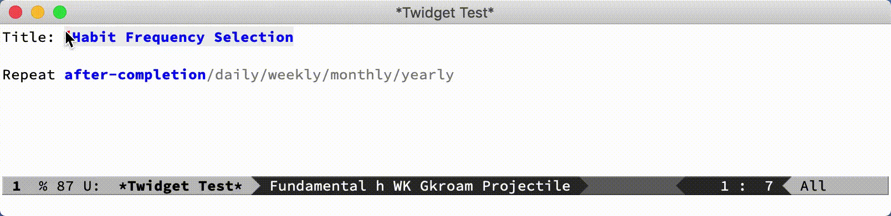
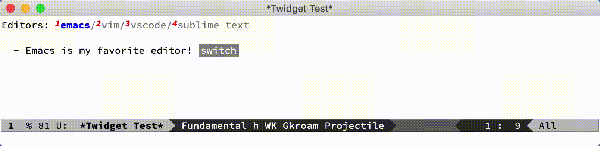
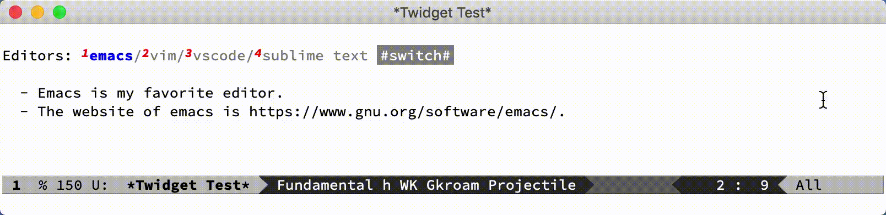
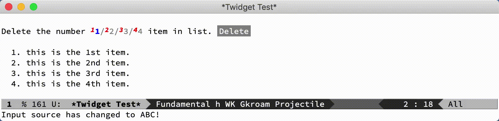
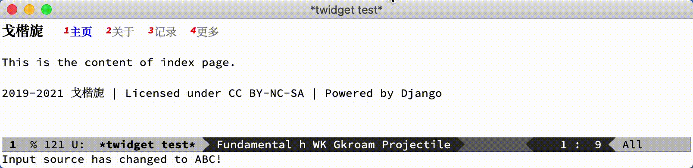

#+TITLE: Twidget - Emacs中的文本控件库

** 目录                                                                 :TOC_3:
  - [[#介绍][介绍]]
  - [[#使用][使用]]
    - [[#基本控件][基本控件]]
    - [[#控件交互][控件交互]]
    - [[#控件api][控件API]]
    - [[#控件组api][控件组API]]
  - [[#说明][说明]]

** 介绍
   *Twidget* 的意思是 text widget, 即文本控件库。Emacs有一个 [[https://www.gnu.org/software/emacs/manual/html_mono/widget.html][widget library]]，我使用后感觉不是很好用，并且需要使用鼠标操作。Twidget的设计遵循了简单易用，全键盘操作的理念，并且和 [[https://www.gnu.org/software/emacs/manual/html_node/elisp/Abstract-Display.html][ewoc]] 做了很好的融合，可以轻松创建一个复杂的交互界面。
   
** 使用
*** 基本控件
    Twidget 目前有3个基本控件: =twidget-text=, =twidget-choice= 和 =twidget-button= 。我们可以使用一些统一的函数或宏来创建这些控件并插入到buffer中。每一种控件都有自己的键值对属性，可以通过指定键值对参数来控制其显示效果或行为。

    *twidget-text 文本控件*

    文本控件 有一个可编辑的区域，可以通过按键修改其展示的值并绑定到变量中。

    主要键值对参数:

    | 属性    | 类型          | 必须 | 含义                                                                                               |
    |---------+---------------+------+----------------------------------------------------------------------------------------------------|
    | :bind   | 符号          | 是   | 控件的:value值会绑定到该符号变量中                                                                 |
    | :value  | 字符串        | 否   | 编辑区域的显示的值                                                                                 |
    | :format | 字符串        | 否   | 完整的控件字符串, 其中用 "[t]" 代表编辑区域                                                        |
    | :length | 数字          | 否   | 文本框的长度，默认值是5                                                                            |
    | :action | 函数/函数列表 | 否   | 编辑区域内容更新后触发的行为, 默认参数为当前的value                                                |
    | :plain  | 布尔值        | 否   | 隐藏编辑区域，显示为不可编辑的纯文本(和 twidget-insert 插入的文本不同的是，该区域可以通过代码修改) |
    | :local  | 布尔值        | 否   | 是否为局部控件, 局部控件在每次刷新(twidget-page-refresh)时会恢复到原始值                           |
    
    *twidget-choice 选择控件*

    选择控件 可以通过按键单选或多选一个列表中的值，并绑定到变量中。

    主要键值对参数:

    | 属性       | 类型          | 必须 | 含义                                                                |
    |------------+---------------+------+---------------------------------------------------------------------|
    | :bind      | 符号          | 是   | 控件的:value值会绑定到该符号变量中                                  |
    | :choices   | 列表          | 是   | 选项列表                                                            |
    | :value     | 字符串/列表   | 否   | 选中的选项值，单选时是字符串，多选时是列表                          |
    | :format    | 字符串        | 否   | 完整的控件字符串, 其中用 "[t]" 代表编辑区域                         |
    | :action    | 函数/函数列表 | 否   | 选择选项后触发的行为, 默认参数为当前的value                         |
    | :separator | 字符串        | 否   | 不同选项间的分隔符，默认为一个空格                                  |
    | :multiple  | 布尔值        | 否   | 是否为多选, 默认为为单选                                            |
    | :fold      | 布尔值        | 否   | 是否折叠隐藏未选择的选项，默认全部显示                              |
    | :require   | 布尔值        | 否   | 是否至少选中一项，默认非必须                                        |
    | :local     | 布尔值        | 否   | 是否为局部控件, 局部控件在每次刷新(twidget-page-refresh)时会恢复到原始值 |

    *twidget-button 按钮控件*

    按钮控件 点击后触发特定的行为。

    | 属性         | 类型   | 必须 | 含义                                    |
    |--------------+--------+------+-----------------------------------------|
    | :bind        | 符号   | 是   | 控件的:value值会绑定到该符号变量中      |
    | :value       | 字符串 | 是   | 按钮显示的文本                          |
    | :action      | 函数   | 是   | 按钮作用后触发的行为                    |
    | :help-echo   | 字符串 | 否   | 鼠标悬浮在按钮上时的tip，默认无         |
    | :follow-link | 布尔值 | 否   | 按钮是否可用鼠标点击，默认不可          |

*** 控件交互
    
    使用 =<tab>= 激活下一个控件, =<shift-tab>= 激活上一个控件。被激活的控件会有数字提示，按数字键进行选择或文本更新，并触发相应的action函数。

*** 控件API

    *环境准备*

    - =with-twidget-buffer (buffer-or-name &rest body)=
      
      在指定 BUFFER-OR-NAME buffer 中创建控件。使用 =pop-to-buffer= 弹出buffer。

    - =with-twidget-setup (&rest body)=

      如果需要自己控制 buffer 的行为，使用该宏包裹twidget的代码。

    - =twidget-buffer-setup & twidget-bind-keymap=

      如果不使用 =with-twidget-setup= 宏，需要在 twidget 代码的开头和结尾分别调用上面的两个函数。

    *插入控件*
    
    - =twidget-create (twidget &rest args)=

      twidget 是控件symbol，其余参数为键值对。

    - =twidget-insert (&rest args)=

      插入一段纯文本，和 =insert= 用法相同。

    #+BEGIN_SRC emacs-lisp
    (defvar habit-regular-feq-type '("after-completion" "daily" "weekly" "monthly" "yearly"))
    (defun habit-freq-type-switch (value)
      (message "current type is \"%s\"!" value))

    (with-twidget-buffer "*Twidget Test*"
      (twidget-create 'twidget-text
        :bind 'habit-freq-title
        :value "Habit Frequency Selection"
        :format "Title: [t]"
        :action (lambda (value)
                  (message "the title is \"%s\"" value)))
      (twidget-insert "\n\n")
      (twidget-create 'twidget-choice
        :bind 'habit-freq-type
        :choices habit-regular-feq-type
        :value "after-completion"
        :format "Repeat [t]"
        :action #'habit-freq-type-switch
        :separator "/"
        ;; :multiple nil
        ;; :fold nil
        ;; :local nil
        :require t))
    #+END_SRC
    
    

    *查询控件属性值*

    - =twidget-query (bind-or-id property)=

    *更新控件*

    一般用于 action 函数中
    
    - =twidget-update (bind-or-id &rest properties)=

      更新单个控件。bind-or-id 指被更新的控件的 =:bind= 属性值或 twidget-id(仅开发用)。properties 是一系列需要更新的键值对。

    #+BEGIN_SRC emacs-lisp
    (defvar example-editors '("emacs" "vim" "vscode" "sublime text"))
    (with-twidget-buffer "*Twidget Test*"
      (twidget-create 'twidget-choice
        :bind 'example-editor
        :choices example-editors
        :format "Editors: [t]"
        :value "emacs"
        :separator "/"
        :action (lambda (value)
                  (twidget-update
                   'example-string :value (capitalize value)))
        :require t)
      (twidget-insert "\n\n")
      (twidget-create 'twidget-text
        :bind 'example-string
        :format "  - [t] is my favorite editor!"
        :value "Emacs"
        :plain t)
      (twidget-create 'twidget-button
        :value "switch"
        :action (lambda (btn)
                  (let* ((choices example-editors)
                         (editor (downcase example-editor))
                         (nth (seq-position choices editor)))
                    (twidget-update
                     'example-editor
                     :value (capitalize (nth (% (1+ nth) (length choices)) choices)))))))
    #+END_SRC

    
    
    - =twidget-multi-update (&rest twidget-properties)=

      更新多个控件。twidget-properties 的形式参考例子。

    #+BEGIN_SRC emacs-lisp
    (defvar example-editors '("emacs" "vim" "vscode" "sublime text"))
    (defvar example-websites
      '(("emacs" "https://www.gnu.org/software/emacs/")
        ("vim" "https://www.vim.org")
        ("vscode" "https://code.visualstudio.com")
        ("sublime text" "https://www.sublimetext.com")))

    (with-twidget-buffer "*Twidget Test*"
      (twidget-create 'twidget-choice
        :bind 'example-editor
        :choices example-editors
        :format "\nEditors: [t]"
        :value "emacs"
        :separator "/"
        :action (lambda (value)
                  (twidget-multi-update
                   'example-string `(:value ,(capitalize value))
                   'example-link `(:value ,(assoc value example-websites))))
        :require t)
      (twidget-create 'twidget-button
        :value "#switch#"
        :action (lambda (btn)
                  (let* ((choices example-editors)
                         (editor (downcase example-editor))
                         (nth (seq-position choices editor)))
                    (twidget-update
                     'example-editor
                     :value (nth (% (1+ nth) (length choices)) choices)))))
      (twidget-insert "\n\n")
      (twidget-create 'twidget-text
        :bind 'example-string
        :format "  - [t] is my favorite editor."
        :value "Emacs"
        :plain t)
      (twidget-create 'twidget-text
        :bind 'example-link
        :format "\n  - The website of [t0] is [t1]."
        :value '("emacs" "https://www.gnu.org/software/emacs/")
        :plain t))
    #+END_SRC
    
    

    *删除控件*

    一般用于 action 函数中

    - =twidget-delete (&rest binds-or-ids)=

      bind 指控件绑定的变量，id 指 overlay twidget-id 的值。

    #+BEGIN_SRC emacs-lisp
    (with-twidget-buffer "*Twidget Test*"
      (twidget-create 'twidget-choice
        :bind 'example-num
        :choices '("1" "2" "3" "4")
        :format "\nDelete the number [t] item in list."
        :value '("1") :separator "/"
        :multiple t)
      (twidget-create 'twidget-button
        :value "Delete"
        :follow-link t
        :action (lambda (btn)
                  (let* ((binds (mapcar (lambda (num)
                                          (intern (format "example-str%s" num)))
                                        example-num))
                         (choices (twidget-query 'example-num :choices))
                         (new-choices
                          (seq-remove (lambda (num) (member num example-num)) choices)))
                    (apply #'twidget-delete binds)
                    (twidget-update 'example-num
                                    ;; if update :choice, :value should also be updated.
                                    :value (car new-choices)
                                    :choices new-choices))))
      (twidget-insert "\n")
      (twidget-create 'twidget-text
        :bind 'example-str1
        :value "\n  1. this is the 1st item."
        :plain t)
      (twidget-create 'twidget-text
        :bind 'example-str2
        :value "\n  2. this is the 2nd item."
        :plain t)
      (twidget-create 'twidget-text
        :bind 'example-str3
        :value "\n  3. this is the 3rd item."
        :plain t)
      (twidget-create 'twidget-text
        :bind 'example-str4
        :value "\n  4. this is the 4th item."
        :plain t))
    #+END_SRC
    
    

*** 控件组API

    控件组是由多个控件组合而成的。定义控件组可以复用相同的结构的控件，只更新需要更新的控件组，这对实现复杂的交互很有帮助。

    - =twidget-group (&rest body)= 定义控件组

    - =twidget-group-create (group &optional next-group)= 创建控件组

    - =twidget-group-delete (group)= 删除控件组

    - =twidget-page-create (&rest groups)= 创建所有控件组

    - =twidget-page-refresh (&rest groups)= 更新所有控件组

    #+BEGIN_SRC emacs-lisp
    (twidget-group 'example-header
      (twidget-create 'twidget-choice
        :bind 'example-tab
        :choices '("主页" "关于" "记录" "更多")
        :format (concat (propertize "戈楷旎" 'face '(bold :height 1.2)) "   [t]")
        :value "主页" :separator "  "
        :action 'example-switch-tabs
        :require t))

    (defun example-switch-tabs (value)
      (pcase value
        ("主页" (twidget-page-refresh 'example-header
                                      'example-index 'example-footer))
        ("关于" (twidget-page-refresh 'example-header
                                      'example-about 'example-footer))
        ("记录" (twidget-page-refresh 'example-header
                                      'example-diary 'example-footer))
        ("更多" (twidget-page-refresh 'example-header
                                      'example-more 'example-footer))))

    (twidget-group 'example-index
      (twidget-insert "\n\n")
      (twidget-insert "This is the content of index page."))

    (twidget-group 'example-about
      (twidget-insert "\n\n")
      (twidget-insert "This is the content of about page."))

    (twidget-group 'example-diary
      (twidget-insert "\n\n")
      (twidget-insert "This is the content of diary page."))

    (twidget-group 'example-more
      (twidget-create 'twidget-choice
        :bind 'example-more-tabs
        :choices '("留言" "视频")
        :format "> [t]"
        :action 'example-switch-more-tabs
        :require t))

    (defun example-switch-more-tabs (value)
      (pcase value
        ("留言" (twidget-page-refresh 'example-header 'example-more
                                      'example-message 'example-footer))
        ("视频" (twidget-page-refresh 'example-header 'example-more
                                      'example-video 'example-footer))))

    (twidget-group 'example-message
      (twidget-insert "\n\n")
      (twidget-insert "This is the content of message page."))

    (twidget-group 'example-video
      (twidget-insert "\n\n")
      (twidget-insert "This is the content of video page."))

    (twidget-group 'example-footer
      (twidget-insert "\n\n2019-" (format-time-string "%Y")
                      " 戈楷旎 | Licensed under CC BY-NC-SA | Powered by Django"))

    (with-twidget-buffer "*twidget test*"
      (twidget-page-create 'example-header 'example-index 'example-footer))
    #+END_SRC

    

** 说明
   Twidget 目前处于测试开发中，后续 API 可能会有变动。如果使用，请密切关注更新。
